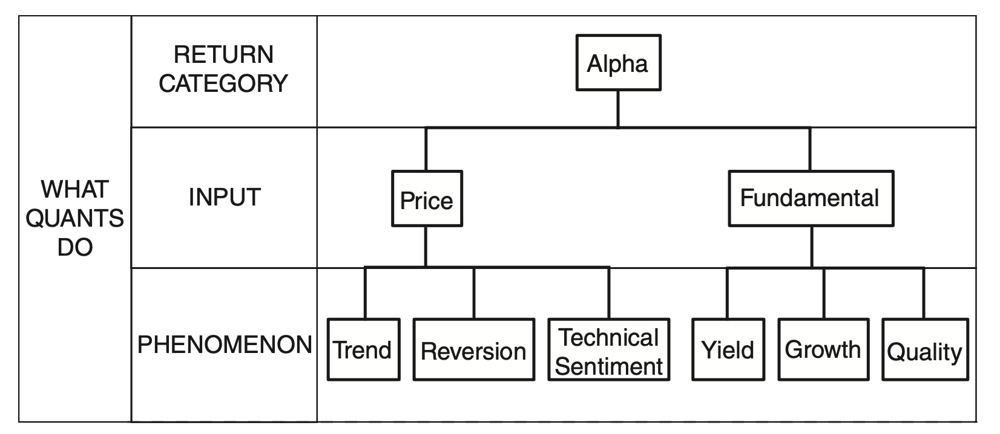

## A Simple Guide to Quantitative and High-frequency Trading

## 一、Alpha模型

Alpha模型是指一种用于预测资产价格变化并获得超额收益的投资策略模型，包含基于理论驱动的模型和基于策略驱动的模型。

### 1.  基于理论驱动的Alpha模型

基于理论驱动的Alpha模型采用经济学理论或金融学理论来构建投资策略模型，这种模型通常基于对市场和资产价格变化的深入分析，
通过对市场中的基本面因素、宏观经济因素等进行建模来预测资产价格变化，并通过对这些预测结果进行有效的利用来获得超额收益，其模型分类如下所示：

#### 基于价格相关数据的策略

基于价格相关数据的 Alpha 模型策略通常是使用价格和交易量等交易数据作为输入，通过对这些数据进行分析和建模来预测资产价格变化。常见基于价格数据的策略包含：

* 趋势跟踪(Trend Following)：
* 均值回归(Mean Reversion)：
* 技术情结(Technical Sentiment)：

### 2. 基于数据驱动的Alpha模型

